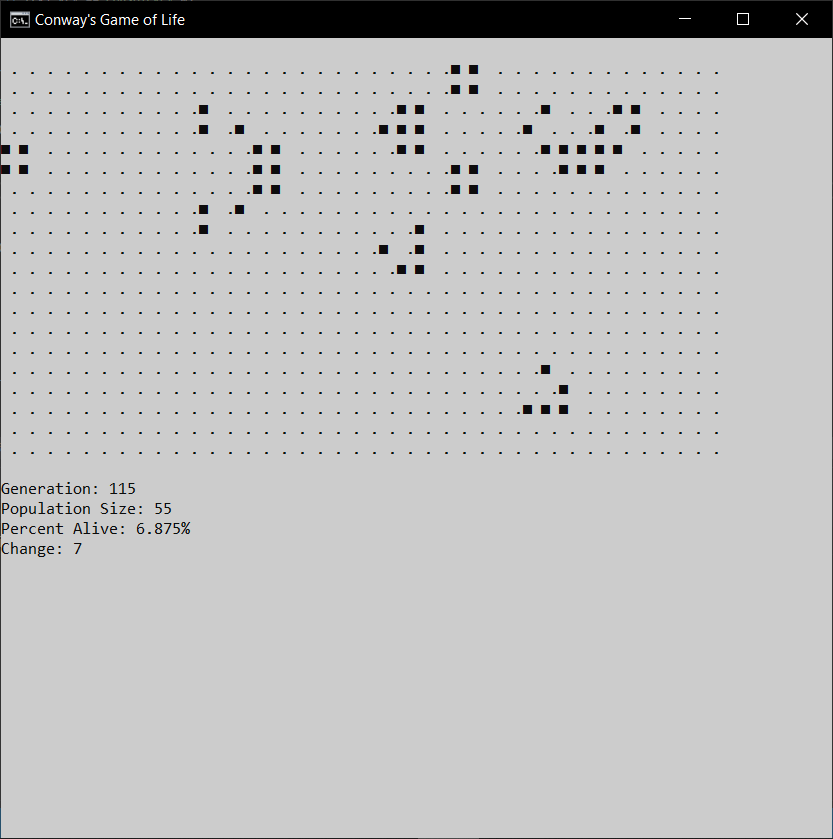

# Conway's Game of Life

## Description

A console application of Conway's Game of Life (GoL) written in C#.

It features a basic interactive menu using key presses, a grid to display the game of life, and some statistics. 

## Usage

Initial configuration (seed) of the game can be either:
* a 'randomised' field of dead/alive cells, or 
* a 'preset' loaded from a .txt file.
Upon choosing a randonised seed, the user may enter a value between 0 and 100 which specifies the chance that a cell may be dead or alive.
Upon choosing a preset, the user may enter the file name to load into the active zone.

As GoL is infinite, but the size of the program is finite, this lead to 'pathological edge effects' when the active area encroaches on the boundaries. This program has three distinct strategies to choose from to handle this:
1. Hard Boundary - when cells cross the boundary outside the 'active zone' they die.
2. Buffer - uses a hidden active zone outside the visible active zone so that edge effects are less noticeable.
3. Wrap - active areas that move across boundaries and reappear on the opposite edge.

Once a valid seed is created, the following rules are applied simultaneosly on each generation:
1. Any live cell with two or three neighbours survives.
2. Any dead cell with three live neighbours becomes a live cell.
3. All other live cells die in the next generation. All other dead cells stay dead.

Below the grid of cells are some statistics on the current generation which include generation #, population size, percentage of cells alive, and change in cells from the current population from the last (+/-).

## Contributors

Code Reviews: Benjamin Sutas | https://github.com/LeftofZen

## References

* https://en.wikipedia.org/wiki/Conway%27s_Game_of_Life
* https://patorjk.com/software/taag/#p=display&f=Graffiti&t=Type%20Something%20

## Screenshots

